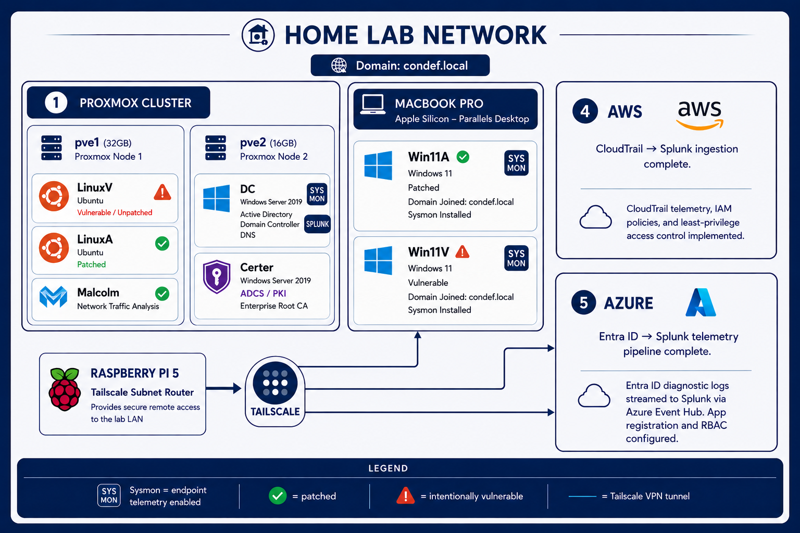

# Cybersecurity Home Lab

A hands-on home lab built to support structured offensive and defensive security training, covering Active Directory attacks, ADCS abuse, Linux exploitation, Kubernetes security, and network traffic analysis.

---

## Lab Network Diagram

---

## Skills Demonstrated

| Area | Tools & Technologies |
|------|---------------------|
| Hypervisor & Infrastructure | Proxmox VE 9.1, Parallels Desktop (Apple Silicon), Proxmox clustering |
| Network Traffic Analysis | Malcolm 26.04.1, Zeek, Arkime, OpenSearch Dashboards |
| SIEM | Splunk Enterprise 9.3.2 ✅ |
| Active Directory | Windows Server 2019, Domain Controller, ADCS (Enterprise Root CA) |
| Endpoint Telemetry | Sysmon — all 3 Windows hosts live (DC, Win11A, Win11V) ✅ |
| Linux Telemetry | Splunk UF + Laurel/auditd on LinuxV ✅ |
| Kubernetes Monitoring | Minikube + Splunk OpenTelemetry Collector via HEC ✅ |
| Cloud Telemetry | AWS CloudTrail + Azure/Entra sign-in logs ✅ |
| Logging & Auditing | Windows Event Auditing, PowerShell Module/Script Block/Transcription logging via GPO |
| Linux Security | Ubuntu 22.04, privilege escalation techniques, kernel vulnerabilities |
| Cloud Security | Azure, AWS (accounts provisioned for course curriculum) |
| Containerization | Docker, Docker Compose, Minikube, Helm |
| Remote Access | Tailscale mesh VPN |
| Scripting & Automation | Bash, PowerShell, netplan, git automation |

---

## VM Inventory

| VM | OS | Host | Role | Sysmon |
|----|----|------|------|--------|
| LinuxV | Ubuntu 22.04.5 | Proxmox node 1 | Vulnerable Linux target (intentionally unpatched) | N/A |
| LinuxA | Ubuntu 22.04.5 | Proxmox node 1 | Patched Linux analyst/attacker machine | N/A |
| Malcolm | Ubuntu 22.04.5 Server | Proxmox node 1 | PCAP & network traffic analysis | N/A |
| DC | Windows Server 2019 | Proxmox node 2 | Domain Controller + DNS + Splunk SIEM | ✅ |
| Certer | Windows Server 2019 | Proxmox node 2 | Active Directory Certificate Services (ADCS) — Enterprise Root CA | — |
| Win11A | Windows 11 | MacBook (Parallels) | Patched Windows workstation — domain joined | ✅ |
| Win11V | Windows 11 | MacBook (Parallels) | Vulnerable Windows workstation — domain joined | ✅ |

> Sysmon is installed on DC, Win11A, and Win11V. ARM64 Windows (Parallels) requires `Sysmon64a.exe` — the x86 binaries are blocked by HVCI. Certer does not require Sysmon per course curriculum.

---

## Telemetry Stack — Complete ✅

| Index | Source | Status |
|-------|--------|--------|
| `winlogs` | DC, Win11A, Win11V, Certer | ✅ Live |
| `sysmon` | DC, Win11A, Win11V | ✅ Live |
| `linux` | LinuxV (Laurel/auditd) | ✅ Live |
| `kube` | LinuxV (Minikube audit logs) | ✅ Live |
| `aws` | AWS CloudTrail | ✅ Live |
| `azure` | Azure/Entra sign-in logs | ✅ Live |

---

## Cloud Accounts

| Platform | Purpose |
|----------|---------|
| Microsoft Azure | Cloud security labs — telemetry, identity, and detection (course curriculum) |
| AWS | Cloud security labs — CloudTrail, IAM, and detection (course curriculum) |

---

## Course Coverage

This lab is built to support the **Just Hacking** course, covering:

- **Active Directory** — enumeration, attacks, lateral movement
- **ADCS** — certificate-based attacks (ESC1–ESC8)
- **Linux attacks** — privilege escalation, kernel exploits
- **Kubernetes** — container security and cluster attacks
- **Network traffic analysis** — PCAP analysis with Malcolm and Zeek
- **SIEM** — log ingestion and detection engineering with Splunk
- **Cloud telemetry** — Azure and AWS log analysis and detection

---

## Build Journal

See [`lab-journal.md`](./lab-journal.md) for a detailed log of the build process, including problems encountered and fixes applied at each phase.

---

## Status

- [x] Proxmox cluster (2 nodes)
- [x] LinuxV — vulnerable target
- [x] LinuxA — analyst machine
- [x] Malcolm — PCAP analysis (static IP, SSL cert trusted)
- [x] DC — Domain Controller (Windows Server 2019, promoted to domain controller)
- [x] Certer — ADCS Enterprise Root CA
- [x] Win11A — patched workstation, domain joined
- [x] Win11V — vulnerable workstation, domain joined
- [x] Sysmon — DC, Win11A, Win11V all live in index=sysmon ✅
- [x] Azure account provisioned
- [x] AWS account provisioned
- [x] Windows Auditing & GPO configured (PowerShell logging, Transcription, Defender disabled)
- [x] Splunk Enterprise deployed — all Windows hosts live ✅
- [x] LinuxV Laurel telemetry — index=linux live ✅
- [x] Kubernetes monitoring — Minikube audit logs via HEC, index=kube live ✅
- [x] AWS CloudTrail — index=aws live ✅
- [x] Azure/Entra telemetry — index=azure live ✅
- [ ] Domain user accounts
- [ ] PCAP lab exercises with Malcolm/Zeek
- [ ] Active Directory attack & defense labs
